# 常见问题解答（FAQ）

本文档收集了用户在使用过程中遇到的常见问题及解决方案。

## 一、烧录

### Q1. 烧录固件时检测不到 DAP-Link

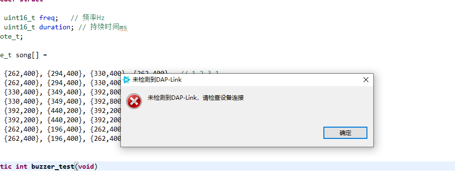

**解决方法：**

在设备管理器中卸载 WinUSB 设备，然后重新插拔一下数据线。

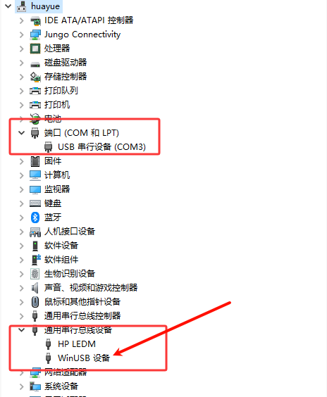

按照上述方式操作之后，设备管理器中显示串口和 CMSIS-DAP 设备，此时可以烧录工程固件了。

------

### Q2. 创建示例工程后第一次编译报错

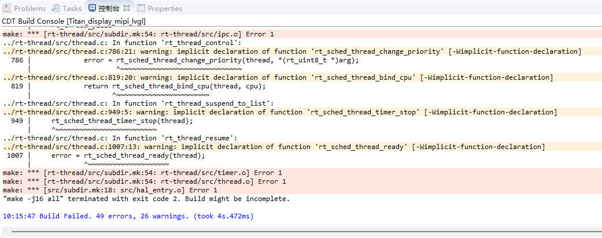

**解决方法：**
右键工程，点击同步 scons 配置至项目。

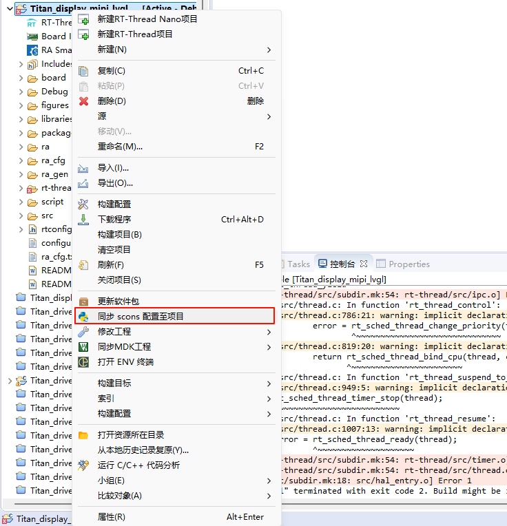

------

### Q3. RFP 创建新项目的时候一直卡在这个界面

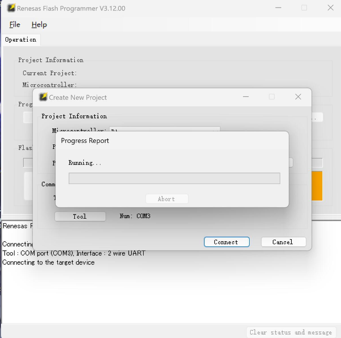

**解决方法：**

1. 选择 Tool

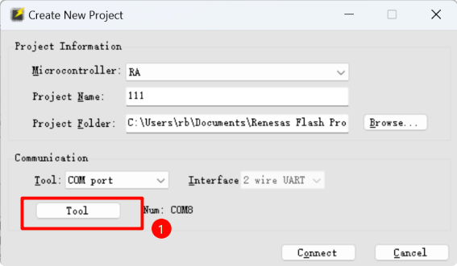

2. 让开发板进入BOOT模式（按住boot按键不松手，同时按下RST按键），出现以下选项后，点击OK连接即可（确保不要松开boot按键，等创建成功后松手）

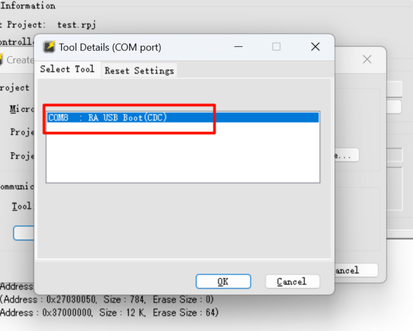

------

### Q4. 使用 RFP 无法烧录 hex

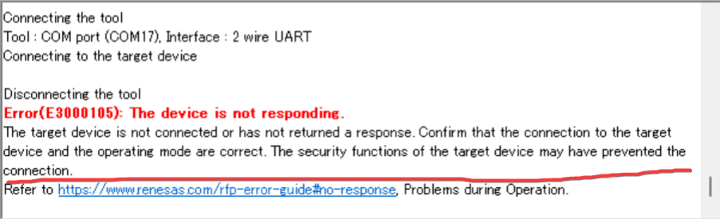

**解决方法：**

1. 需要连接丝印为 USB-DEV 的 USB 接口

2. 确定开发板进入 boot 模式

------

### Q5. 芯片出现了无法烧录的情况

**解决方法：**
假如芯片出现了无法烧录的情况，那么可以使用如下方式对芯片进行初始化：

先让开发板进入Boot模式，然后点击下图初始化芯片

------

### Q6. 点击下载固件后，出现以下错误：Error(E0000305): The program file exceeds the flashmemory size of target device.Operation failed.

**解决方法:**

参考下图

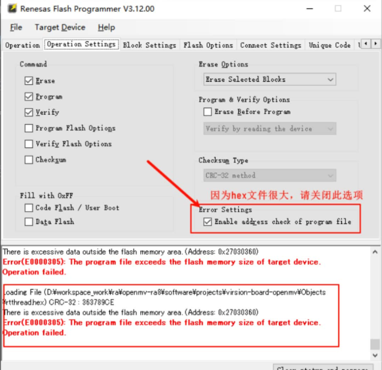

------

### Q7. 使用 DAP-Link 烧录双核程序导致 DAP-Link 烧录程序异常

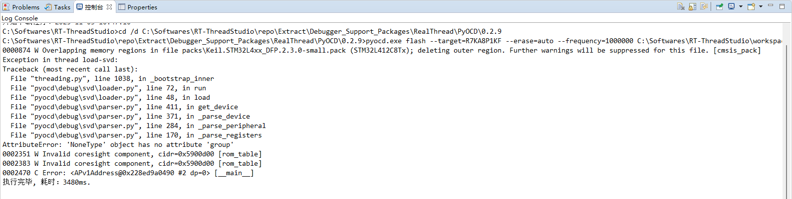

**解决方法：**

1. 方法一：使用 RFP 初始化设备并烧录一个单核工程。

2. 方法二：社区开发者分享了一篇更换调试器固件的文章：https://club.rt-thread.org/ask/article/3387ad4472d12ead.html，该固件支持烧录双核工程。

------

### Q8. 烧录程序时提示找不到 rtthread.bin (找不到指定文件)

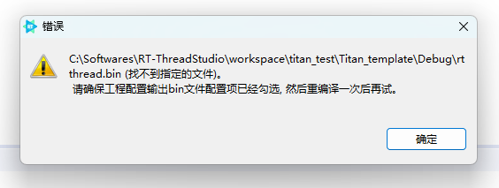

**解决方法:**

配置工程的调试下载参数

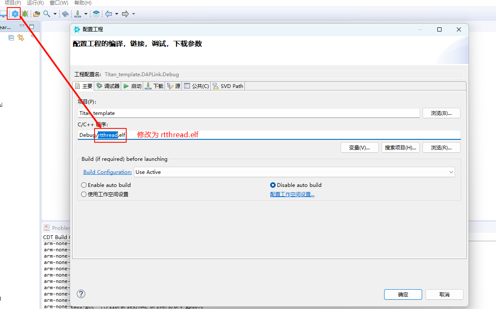

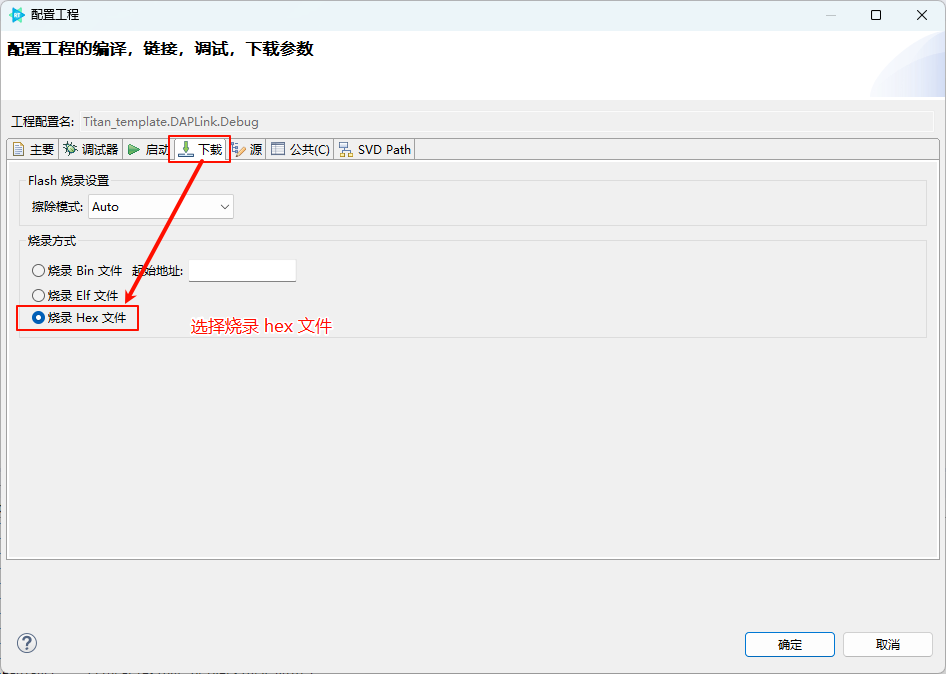

------

##  二、摄像头屏幕接线

### Q9. 摄像头接线

**解决方法：**

* MIPI CSI：

​	使用 22Pin 异向排线连接开发板的 MIPI DSI/CSI 排线座与摄像头转接板的 MIPI 排线座。

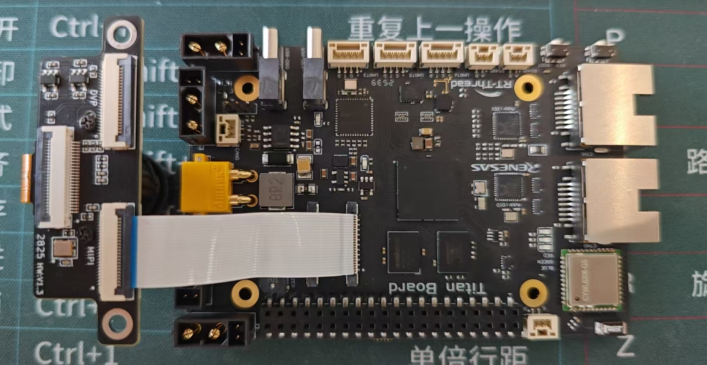

* CEU：

​	使用 22Pin 异向排线连接开发板的 CEU_CAM 排线座与摄像头转接板的 DVP 排线座。

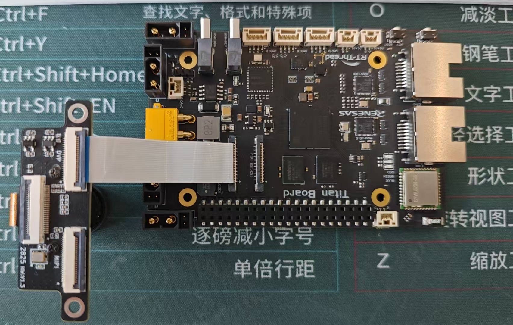

------

### Q10. RGB LCD 接线

**解决方法:**

屏幕型号：正点原子 4.3寸 RGBLCD 800*480

使用 40Pin 同向排线连接开发板的 LCD_RGB 排线座与屏幕。

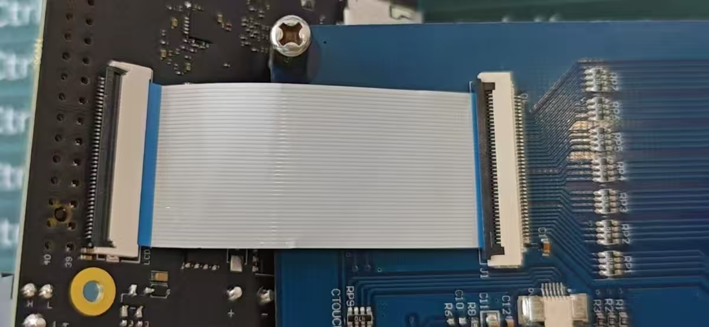

------

### Q11. MIPI LCD 接线

**解决方法:**

屏幕型号：冠显 TL043WVV02CT

使用 22Pin 异向排线连接开发板的 MIPI DSI/CSI 排线座与屏幕转接板的 DIS-MIPI 排线座，MIPI 屏幕连接转接板的 TITAN-MIPI 排线座。

>需要使用杜邦线连接一个 GPIO 和转接板上的 BL 引脚给屏幕提供背光

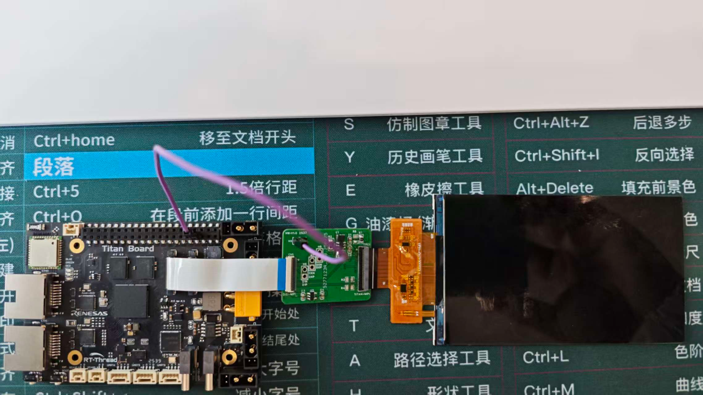

------

## 三、运行

### Q12. 系统运行一段时间后卡死

**解决方法：**
 可能原因包括：

- 任务栈空间不足 → 可在线程创建时增大栈大小。
- 内存泄漏 → 检查内存使用情况。
- 死锁或优先级反转 → 检查互斥锁和信号量使用。

------

## 反馈与支持

如有其他问题，可通过以下方式获取帮助：

-  查看项目文档：[用户手册](https://rt-thread-studio.github.io/sdk-bsp-ra8p1-titan-board/)
- 提交问题反馈：[GitHub Issues](https://github.com/RT-Thread-Studio/sdk-bsp-ra8p1-titan-board/issues)
- 联系技术支持：[RT-Thread 社区论坛](https://club.rt-thread.org/)