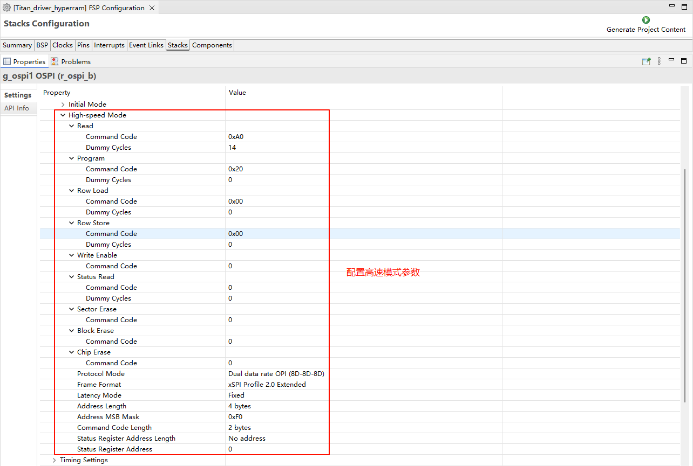

# MIPI CSI 摄像头使用说明

**中文**|[**English**](README.md)

## 简介

本示例展示了如何在 **Titan Board** 上使用 **MIPI CSI（Camera Serial Interface）** 接口连接 **OV5640 摄像头**，并通过 **RT-Thread LCD 框架**将捕获的图像显示到 **RGB565 LCD 屏幕**。

主要功能包括：

- 初始化 MIPI CSI 摄像头接口，捕获实时视频流
- 配置 OV5640 摄像头参数（分辨率、帧率、输出格式）
- 使用 RT-Thread LCD 驱动显示摄像头捕获的图像
- 支持图像格式转换（YUV422 → RGB565）

## RA8 系列 MIPI CSI 特性

RA8 系列 MCU 集成 **MIPI CSI 硬件模块**，用于高速、低功耗摄像头数据采集，适合高清视频和实时图像处理。

### 1. 硬件接口特性

1. **接口类型**
   - **MIPI CSI-2** D-PHY 接口，支持高带宽串行传输
   - 支持 1–4 数据通道 (Lanes)
   - 同步信号由 MIPI D-PHY 控制，无需额外 HSYNC/VSYNC
2. **数据速率与分辨率**
   - 支持每通道最高 1.5–2.5 Gbps（取决 MCU 系列和 PHY 配置）
   - 可驱动常见摄像头分辨率：VGA、QVGA、SXGA、UXGA、1080p 等
3. **摄像头兼容性**
   - 兼容 OV5640、IMX219 等常见 CMOS 摄像头
   - 支持摄像头寄存器配置和自动初始化

### 2. 图像格式与处理能力

1. **图像格式支持**
   - **RAW10 / RAW12**（用于算法开发和图像处理）
   - **YUV422**（用于视频显示）
   - **RGB565**（适合 LCD 显示）
2. **图像处理功能**
   - **颜色空间转换**（YUV → RGB）
   - **图像裁剪**（ROI capture）
   - **镜像与翻转**
   - **硬件缩放加速**
3. **硬件加速**
   - MIPI CSI 内置 DMA，可减轻 CPU 负担
   - 高速格式转换与缩放

### 3. DMA 支持与缓冲机制

1. **高速 DMA 传输**
   - 与 MCU DMAC 协作，将图像直接写入内存或 LCD 缓冲区
   - 减少 CPU 干预，提高帧率
2. **多缓冲区机制**
   - 支持双缓冲或环形缓冲，实现连续视频采集
   - 避免帧丢失和显示延迟
3. **DMA 配置灵活**
   - 可配置缓冲区起始地址和大小
   - 支持中断回调处理

### 4. 中断机制

1. **中断类型**
   - **帧完成中断**：每帧采集完成时触发
   - **行完成中断（可选）**
   - **错误中断**：缓冲区溢出、PHY 错误等
2. **中断特点**
   - 支持 RT-Thread ISR 回调
   - 可与 DMA 联动，实现实时显示

### 5. 时序与同步特性

1. **同步方式**
   - CSI 使用 MIPI D-PHY 提供时钟和数据同步
   - 无需额外 HSYNC/VSYNC
2. **像素时钟与数据对齐**
   - 支持按像素对齐或按字节对齐
   - 自动处理 RAW/YUV/RGB 数据对齐

### 6. 性能优化

1. **高吞吐量**
   - DMA + 双缓冲实现无间断视频采集
   - CPU 占用低，适合实时应用
2. **可靠性**
   - PHY 错误、数据丢失中断可触发异常处理
   - 支持缓冲区溢出检测
3. **灵活性**
   - 多分辨率、多格式支持
   - 支持 ROI 捕获和硬件缩放，提高显示效率

### 7. 应用场景

- 实时视频显示到 LCD
- 视频采集与处理算法验证
- 嵌入式视觉应用，如监控、手势识别、机器人视觉

## RA8 系列 MCU GLCDC（Graphics LCD Controller）特性

RA8 系列 MCU（如 RA8P1）集成 **GLCDC 硬件模块**，用于驱动 TFT/LCD 显示屏，实现高速图形渲染和视频显示，支持多种分辨率、色彩格式和显示模式。

### 1. 硬件特性

1. **分辨率支持**
   - 可驱动从 QVGA (320×240) 到 WQVGA/XGA 等常用分辨率
   - 受片上 RAM 和显示接口带宽限制
2. **色彩支持**
   - 支持 1/4/8/16/24/32 位色深
   - 常用 RGB565、RGB888 格式
   - 支持调色板模式（Palette mode）
   - 可硬件进行色彩转换
3. **接口类型**
   - 并行 RGB（TFT LCD 接口）
   - 支持 16/18/24 位数据总线
   - 可与外部 LCD 面板直接连接
   - 时序可编程：HSYNC、VSYNC、DE、PCLK、RGB 输出

### 2. 图层与显示模式

1. **图层支持**
   - 单图层模式（单画面显示）
   - 多图层模式（通过调色板或硬件 alpha 混合叠加）
   - 支持透明/半透明叠加
2. **显示模式**
   - RGB 模式（直显颜色输出）
   - CLUT/Palette 模式（索引颜色，通过查表转换）
   - 可配置扫描方向（水平/垂直扫描）

### 3. DMA 与帧缓冲

1. **帧缓冲访问**
   - GLCDC 可直接访问片上/外部 SRAM 中的帧缓冲
   - 支持单缓冲、双缓冲模式
   - 支持环形缓冲，用于连续刷新
2. **DMA 支持**
   - 与 MCU DMAC 协同工作，减少 CPU 占用
   - 可将图像直接从内存传输到 LCD
   - 支持行、块或全帧传输

### 4. 硬件图形功能

1. **窗口裁剪与缩放**
   - 可指定显示窗口区域
   - 可支持简单缩放（水平/垂直）
2. **硬件图形加速**
   - 支持矩形填充、颜色替换
   - 支持图像透明处理
   - 可结合 CEU 或 DMA 进行视频显示
3. **颜色格式转换**
   - YCbCr → RGB
   - RGB888 → RGB565
   - 硬件加速，减少 CPU 负担

### 5. 中断机制

1. **中断类型**
   - 帧完成中断（Frame End）
   - 行中断（Line End，可选）
   - 访问错误/溢出中断
2. **中断应用**
   - 与 RT-Thread ISR 集成
   - 可在帧完成时触发更新缓冲区或切换双缓冲
   - 方便实现动画和视频显示

### 6. 性能优化

1. **双缓冲机制**
   - 支持双缓冲减少闪烁
   - CPU 可在后台绘制下一帧
   - GLCDC 硬件自动切换显示缓冲
2. **帧率控制**
   - 可编程时钟和行/帧同步
   - 支持 30fps、60fps 等常见刷新率
3. **CPU 卸载**
   - 大量图形操作由硬件完成
   - DMA + GLCDC 结合，实现高效图像显示

## 硬件说明

MIPI DSI/CSI接口和 RGB LCD 接口如下图所示：

## FSP 配置

### HyperRAM 配置

* 新建 r_ospi_b stack：

* 配置 r_ospi_b stack：

* HyperRAM 引脚配置：

* HyperRAM 所有相关引脚的驱动能力配置为 H，OM_1_SIO0~OM_1_SIO7 需要配置为输入上拉。

### I2C0 配置

* 新建 `r_iic_master` stack：

* 配置 I2C0：

* 配置 I2C0 引脚：

### VIN 配置

* 新建 `r_vin` stack：

* 配置 VIN：

### MIPI CSI 配置

* 配置 MIPI CSI：

* 配置 MIPI 引脚：

### MIPI PHY 配置

* 设置 MIPI PHY 模块名称：

### D/AVE 2D 配置

* 新建 `r_drw` stack：

### RGB LCD 配置

* 新建 `r_glcdc` stack：

* 配置中断回调和图形层1：

* 配置输出参数、CLUT、TCON和抖动。

* 配置 GLCDC 的引脚：

### LCD 背光配置

* 新建 `r_gpt` stack：

* 配置背光 PWM 输出：

## RT-Thread Settings 配置

* 使能 MIPI CSI 摄像头，使用 i2c0；使能 RGB565 LCD，使用 pwm7 输出背光。

## 编译&下载

- RT-Thread Studio：在RT-Thread Studio 的包管理器中下载 Titan Board 资源包，然后创建新工程，执行编译。

编译完成后，将开发板的 USB-DBG 接口与PC 机连接，然后将固件下载至开发板。

## 运行效果

复位 Titan Board 后终端会输出如下信息：

下面是 LCD 屏幕上显示的图像：

