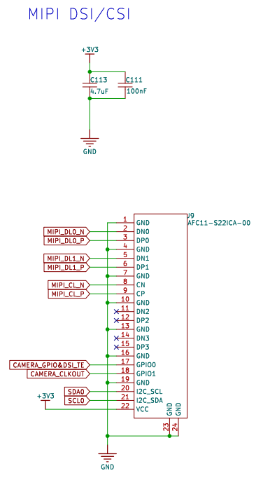
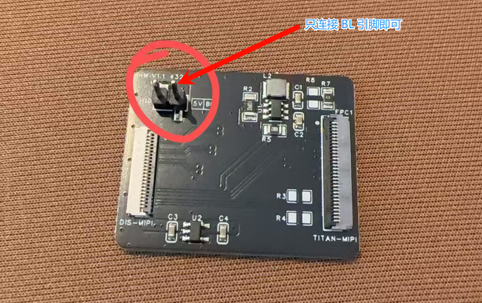
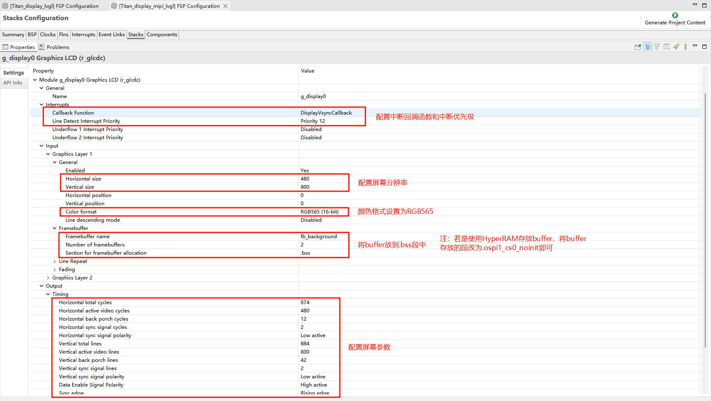
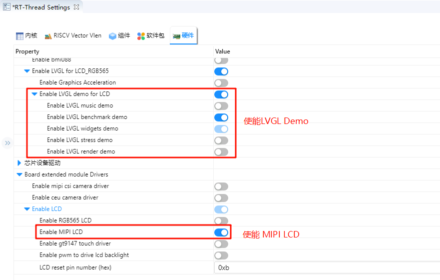

# MIPI DSI LVGL 示例说明

**中文** | [**English**](./README.md)

## 简介

本示例基于 **LVGL** 图形库，构建了一个适用于嵌入式设备的图形用户界面（GUI）示例项目，结合实际的显示驱动和输入驱动，展示了从底层驱动适配到上层界面构建的完整流程。通过该示例，开发者不仅可以学习如何在嵌入式环境中移植和配置 LVGL，还能掌握界面布局、事件响应、主题定制等关键技术点，从而为后续构建实际产品界面打下基础。

## LVGL 简介

**LVGL**（Light and Versatile Graphics Library，轻量且多功能的图形库）是一个开源的嵌入式 GUI（图形用户界面）开发框架。它的设计初衷是为资源受限的嵌入式设备提供流畅、现代化的图形界面，因此在运行效率、内存占用和可移植性方面都做了大量优化。无论是在简单的低端 MCU 上，还是在功能更强大的 MPU 平台上，LVGL 都能够高效运行，并提供丰富的图形控件和交互体验。

### 主要特点

1. **轻量级**
    LVGL 最大的优势在于轻量化，它对资源的需求非常低。在一个内存只有几十 KB 的微控制器上，LVGL 依然可以流畅运行。框架本身的内存开销较小，渲染算法经过精心优化，既可以保证较低的 CPU 使用率，又能在有限的硬件条件下呈现出较好的视觉效果。这使得 LVGL 特别适合那些对硬件资源敏感的应用场景，比如低功耗设备、可穿戴设备、家用电器控制面板等。
2. **跨平台**
    LVGL 的跨平台特性非常突出，它能够运行在多种操作系统之上，包括 FreeRTOS、RT-Thread、Zephyr、Linux 等，也可以直接运行在裸机环境中。开发者只需要为 LVGL 提供底层的显示驱动和输入驱动接口，便可以快速完成移植，从而在不同的硬件平台之间复用同一套 UI 代码。这种灵活性大大降低了开发成本，使得 LVGL 成为嵌入式 GUI 的通用解决方案。
3. **丰富的控件（Widgets）**
    LVGL 内置了种类丰富的 GUI 控件，例如按钮、标签、滑条、进度条、复选框、列表、表格、图表等。这些控件几乎涵盖了常见人机交互界面的需求，开发者无需从零开始设计和实现组件，大大缩短了开发周期。同时，LVGL 还允许用户基于现有控件扩展新的组件，从而构建符合特定需求的界面。无论是简单的数字显示，还是复杂的图形控制界面，LVGL 都能胜任。
4. **多样的渲染能力**
    在视觉呈现方面，LVGL 提供了丰富的渲染功能。它支持抗锯齿、透明度、渐变、阴影、边框、圆角等效果，可以让界面看起来更加美观和现代。除此之外，LVGL 还内置动画系统，支持多种缓动函数，能够实现平滑的控件移动、渐变过渡和动态效果。这些特性使得界面不仅功能完善，还能带来良好的用户体验。
5. **输入设备支持**
    LVGL 支持多种输入设备类型，包括触摸屏、电容屏、鼠标、键盘和编码器，甚至可以实现多点触控交互。它提供了统一的输入接口层，开发者只需实现底层的驱动适配，就能轻松把输入事件传递到 LVGL 的事件系统中。这样一来，开发者可以更加专注于上层的界面逻辑，而不必花费过多时间在输入事件处理上。
6. **国际化与多语言**
    LVGL 在国际化方面也有很好的支持。它使用 UTF-8 编码，可以处理几乎所有语言的字符集。同时，它支持双向文本渲染，可以正确显示如阿拉伯语、希伯来语等从右到左书写的语言。这使得 LVGL 能够应用在面向全球用户的产品中，不同国家和地区的用户都能通过本地化界面获得良好的体验。
7. **可扩展性**
    LVGL 提供了灵活的主题和样式系统，开发者可以方便地定制控件的外观样式，以实现不同风格的 UI。通过更换主题，可以快速切换界面的整体视觉风格。此外，LVGL 还可以与第三方图形库、文件系统和图像解码器结合使用，从而扩展其功能。例如，可以使用文件系统来加载外部字体和图片，或者集成 JPEG/PNG 解码库来显示复杂图像。

### 应用场景

LVGL 在实际应用中有着非常广泛的覆盖范围。在消费电子领域，它常用于智能家居控制面板、家电显示屏、智能手表和健身设备等，这些产品往往需要在有限硬件资源下提供友好的用户交互界面。在工业控制领域，LVGL 被用于 HMI（人机交互界面）和各种仪器仪表，帮助用户直观地监控和操作设备。在汽车电子中，LVGL 可以驱动中控屏、副驾娱乐屏，甚至车载仪表盘。而在医疗设备方面，它则适合做小型显示界面，例如手持检测仪、便携式监护设备等。

### 生态与社区

LVGL 作为一个开源项目，采用 **MIT License** 开源协议，既适合个人学习，也可以在商业产品中免费使用。围绕 LVGL，已经形成了一个活跃的生态系统。官方提供了 **SquareLine Studio** 这类可视化设计工具，支持拖拽式设计界面并导出 LVGL 代码，极大地提升了开发效率。此外，**LVGL Simulator** 可以让开发者直接在 PC 上进行界面调试，不需要每次都烧录到目标硬件上。全球开发者社区十分活跃，贡献了大量开源控件、主题和移植案例，为新手和企业开发者提供了丰富的资源和支持。

## 硬件说明

下图是 Titan Board 上的 MIPI DSI/CSI 接口，连接 MIPI DSI 屏幕需要再接一块转接板。



在本示例中，需要使用一根杜邦线连接屏幕转接板上的 BL 引脚与 PB07 引脚（提供背光的 GPIO 引脚可以自由修改）。



## FSP 配置

### HyperRAM 配置

* 新建 r_ospi_b stack：


* 配置 r_ospi_b stack：


* HyperRAM 引脚配置：


* HyperRAM 所有相关引脚的驱动能力配置为 H，OM_1_SIO0~OM_1_SIO7 需要配置为输入上拉。


### LCD 配置

* 新建 `r_glcdc` stack：


* 配置中断回调和图形层1：



* 配置输出参数、CLUT、TCON和抖动。


### MIPI DSI 配置

* 添加 r_mipi_dsi stack。


* 配置 MIPI DSI_TE 引脚。


### D/AVE 2D 配置

* 新建 `r_drw` stack：


## RT-Thread Settings 配置

* 使能 MIPI LCD、使能 LVGL。



## 软件说明

LVGL 相关代码在 `./board/lvgl` 中。

* lv_port_disp.c

```c
#include <lvgl.h>
#include <rtthread.h>
#include "ra8/lcd_config.h"
#include "hal_data.h"

static rt_sem_t _SemaphoreVsync = RT_NULL;
static uint8_t lvgl_init_flag = 0;

void DisplayVsyncCallback(display_callback_args_t *p_args)
{
    rt_interrupt_enter();
    if (DISPLAY_EVENT_LINE_DETECTION == p_args->event)
    {
        if (lvgl_init_flag != 0)
            rt_sem_release(_SemaphoreVsync);
    }
    rt_interrupt_leave();
}

static void vsync_wait_cb(lv_display_t *display)
{
    if (!lv_display_flush_is_last(display)) return;

    //
    // If Vsync semaphore has already been set, clear it then wait to avoid tearing
    //
    rt_sem_take(_SemaphoreVsync, RT_WAITING_FOREVER);
}

static void disp_flush(lv_display_t *display, const lv_area_t *area, uint8_t *px_map)
{
    if (!lv_display_flush_is_last(display)) return;

#if (BSP_CFG_DCACHE_ENABLED)
    int32_t size;
    /* Invalidate cache - so the HW can access any data written by the CPU */
    size = sizeof(fb_background[0]);

    SCB_CleanInvalidateDCache_by_Addr(px_map, size);
#endif

    R_GLCDC_BufferChange(&g_display0_ctrl,
                         (uint8_t *) px_map,
                         (display_frame_layer_t) DISPLAY_FRAME_LAYER_1);
}

void lv_port_disp_init(void)
{
    static rt_device_t device;
    /* LCD Device Init */
    device = rt_device_find("lcd");
    RT_ASSERT(device != RT_NULL);

    _SemaphoreVsync = rt_sem_create("lvgl_sem", 1, RT_IPC_FLAG_PRIO);

    if (RT_NULL == _SemaphoreVsync)
    {
        rt_kprintf("lvgl semaphore create failed\r\n");
        RT_ASSERT(0);
    }

    /*------------------------------------
     * Create a display and set a flush_cb
     * -----------------------------------*/
    lv_display_t *disp = lv_display_create(LV_HOR_RES_MAX, LV_VER_RES_MAX);
    lv_display_set_flush_cb(disp, disp_flush);
    lv_display_set_flush_wait_cb(disp, vsync_wait_cb);
    lv_display_set_buffers(disp, &fb_background[0][0], &fb_background[1][0], sizeof(fb_background[0]), LV_DISPLAY_RENDER_MODE_FULL);

    lvgl_init_flag = 1;
}
```

## 编译&下载

* RT-Thread Studio：在RT-Thread Studio 的包管理器中下载 Titan Board 资源包，然后创建新工程，执行编译。


编译完成后，将开发板的 USB-DBG 接口与 PC 机连接，然后将固件下载至开发板。

## 运行效果

复位开发板后就能在 LCD 屏幕上看到 LVGL Demo 正在运行。


