# LVGL Usage Instructions

**English** | [**Chinese**](./README_zh.md)

## Instruction

This example is based on the **LVGL** graphics library and demonstrates a sample graphical user interface (GUI) project designed for embedded devices. It integrates both display and input drivers, showcasing the complete workflow from low-level driver adaptation to high-level interface construction. Through this example, developers can not only learn how to port and configure LVGL in an embedded environment but also gain practical knowledge of key techniques such as interface layout, event handling, and theme customization, thereby laying a solid foundation for building real product interfaces.

## LVGL Instruction

**LVGL** (Light and Versatile Graphics Library) is an open-source embedded GUI (Graphical User Interface) development framework. It was designed with the goal of providing smooth and modern graphical interfaces for resource-constrained embedded devices. To achieve this, it has been highly optimized in terms of runtime efficiency, memory usage, and portability. Whether running on simple low-end MCUs or more powerful MPU platforms, LVGL can operate efficiently while offering a wide range of graphical widgets and interactive features.

### Key Features

1. **Lightweight**
    The greatest advantage of LVGL is its lightweight nature, requiring very few resources. It can still run smoothly on microcontrollers with only a few dozen KB of memory. The framework itself has minimal memory overhead, and its rendering algorithms are carefully optimized to ensure low CPU usage while delivering good visual performance on limited hardware. This makes LVGL particularly suitable for resource-sensitive scenarios such as low-power devices, wearables, and home appliance control panels.
2. **Cross-Platform**
    LVGL stands out for its cross-platform capability. It can run on multiple operating systems including FreeRTOS, RT-Thread, Zephyr, and Linux, or even directly on bare-metal systems. Developers only need to provide display and input driver interfaces for LVGL, and porting can be completed quickly, enabling the same UI code to be reused across different hardware platforms. This flexibility significantly reduces development costs and makes LVGL a universal solution for embedded GUIs.
3. **Rich Widgets**
    LVGL comes with a wide variety of built-in GUI widgets such as buttons, labels, sliders, progress bars, checkboxes, lists, tables, and charts. These components cover nearly all common HMI (Human-Machine Interface) requirements, sparing developers from designing and implementing them from scratch and thus shortening the development cycle. LVGL also allows extending existing widgets to create custom components, making it adaptable for both simple numeric displays and complex graphical control interfaces.
4. **Advanced Rendering Capabilities**
    In terms of visual presentation, LVGL offers a rich set of rendering features. It supports anti-aliasing, transparency, gradients, shadows, borders, and rounded corners, enabling modern and visually appealing interfaces. Additionally, LVGL includes a built-in animation system with multiple easing functions, making smooth movements, transitions, and dynamic effects easy to implement. These capabilities enhance not only functionality but also the overall user experience.
5. **Input Device Support**
    LVGL supports multiple input device types, including touchscreens, capacitive panels, mice, keyboards, and rotary encoders, with even multi-touch interaction available. A unified input interface layer is provided, so developers only need to implement low-level driver adaptation to pass input events into LVGL’s event system. This allows them to focus on interface logic instead of spending excessive time on input handling.
6. **Internationalization and Multilanguage Support**
    LVGL has excellent internationalization support. It uses UTF-8 encoding, which can handle nearly all character sets. It also supports bidirectional text rendering, ensuring correct display of languages such as Arabic and Hebrew that are written right-to-left. This makes LVGL suitable for globally targeted products, allowing users in different countries and regions to enjoy a localized and seamless experience.
7. **Extensibility**
    LVGL provides a flexible theming and styling system, enabling developers to easily customize the appearance of widgets to achieve various UI styles. By switching themes, the overall look and feel of the interface can be changed quickly. Furthermore, LVGL can integrate with third-party graphics libraries, file systems, and image decoders to expand its functionality. For instance, developers can use a file system to load external fonts and images, or integrate JPEG/PNG decoders to display complex images.

### Application Scenarios

LVGL has a very broad range of real-world applications. In consumer electronics, it is commonly used in smart home control panels, appliance displays, smartwatches, and fitness devices, all of which require user-friendly interfaces on constrained hardware. In industrial control, LVGL is applied to HMIs (Human-Machine Interfaces) and various instruments, helping users intuitively monitor and control equipment. In automotive electronics, LVGL can power infotainment systems, passenger entertainment displays, and even instrument clusters. In the medical field, it is well-suited for small-scale displays, such as handheld diagnostic tools and portable monitoring devices.

### Ecosystem and Community

As an open-source project under the **MIT License**, LVGL is equally suitable for personal learning and free use in commercial products. Around LVGL, an active ecosystem has formed. Official tools such as **SquareLine Studio** provide visual drag-and-drop design with exportable LVGL code, greatly improving development efficiency. The **LVGL Simulator** enables developers to debug interfaces directly on a PC without repeatedly flashing target hardware. A vibrant global developer community contributes numerous open-source widgets, themes, and porting examples, offering valuable resources and support to both beginners and enterprise developers.

## Hardware Description

To run this example, an external RGB565 LCD screen is required. The 40-pin RGB565 LCD interface on the development board is as follows:

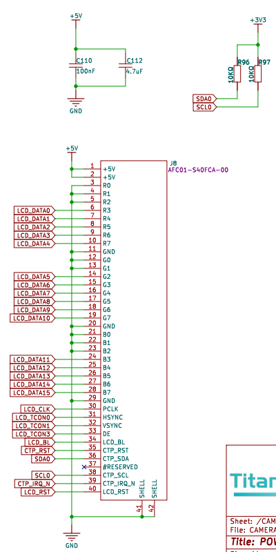

## FSP Configuration

### RGB LCD Configuration

* Create a  `r_glcdc` stack:


* Configure interrupt callback and Graphics Layer 1:


* Configure output parameters, CLUT, TCON, and Dsithering：

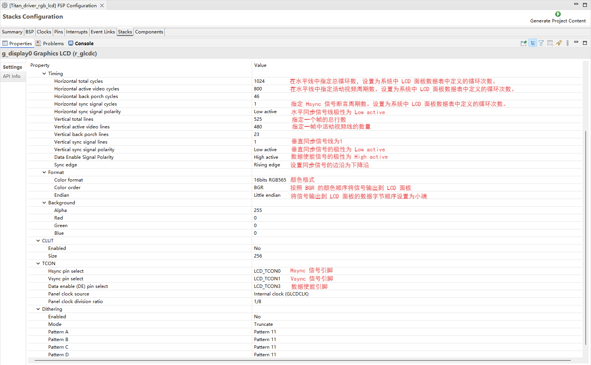

* Configure GLCDC pins:

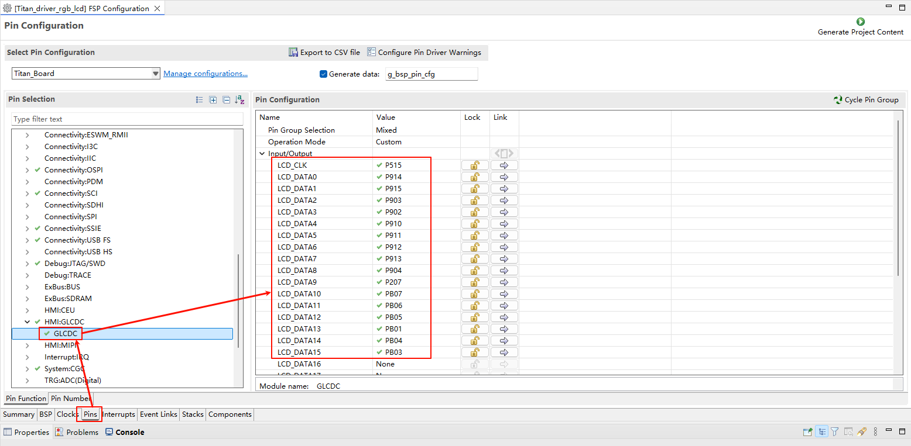


### LCD Backlight Configuration

* Create a  `r_gpt` stack:


* Configure backlight PWM output:


### D/AVE 2D Configuration

* Create a `r_drw` stack:

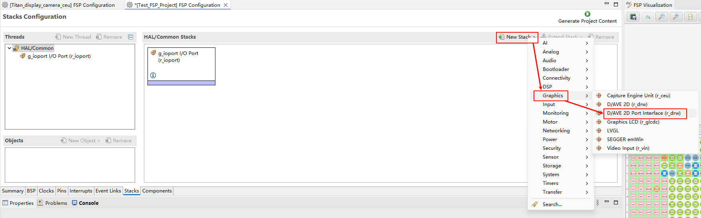

### I2C0 Configuration

* Create a  `r_iic_master` stack:


* Configure I2C0:

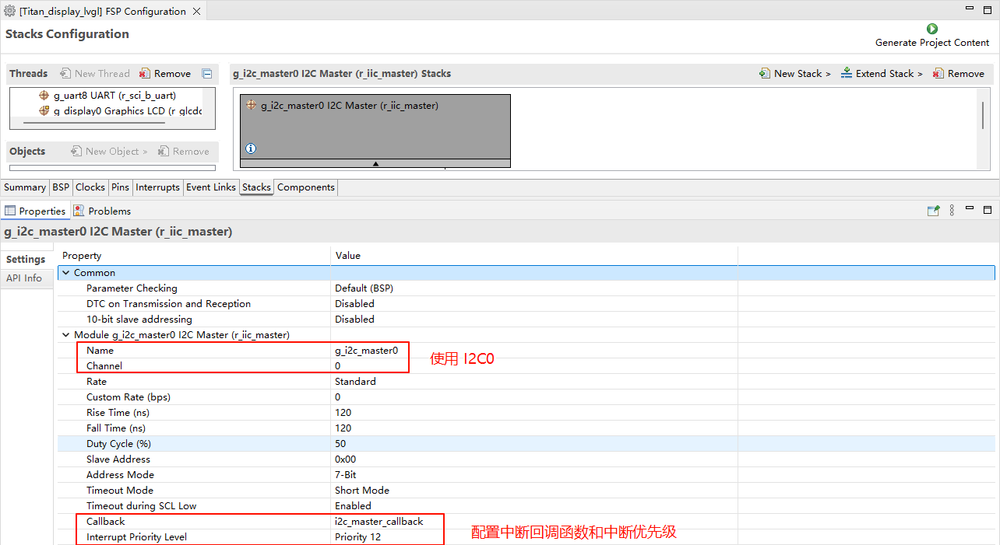

* Configure I2C0 pins:

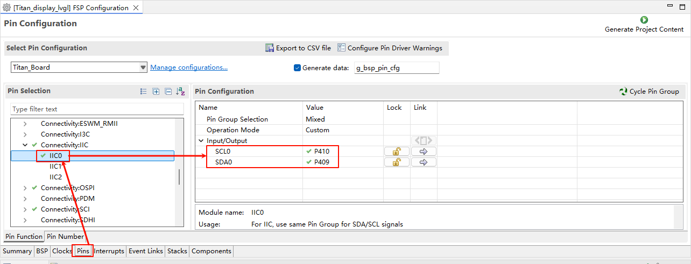

### Touch Interrupt Configuration

* Create a  `r_icu` stack:

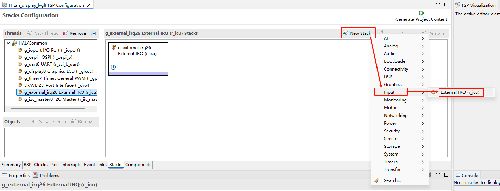

* Configure IRQ28:

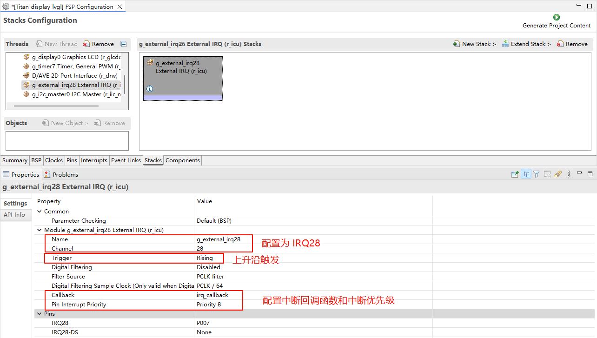

* Configure IRQ28 pins:

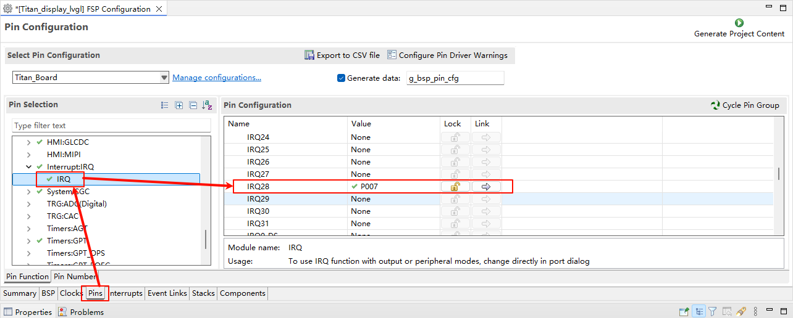

## RT-Thread Settings Configuration

* Enable the RGB565 LCD, the GT9147 touch driver, and LVGL.

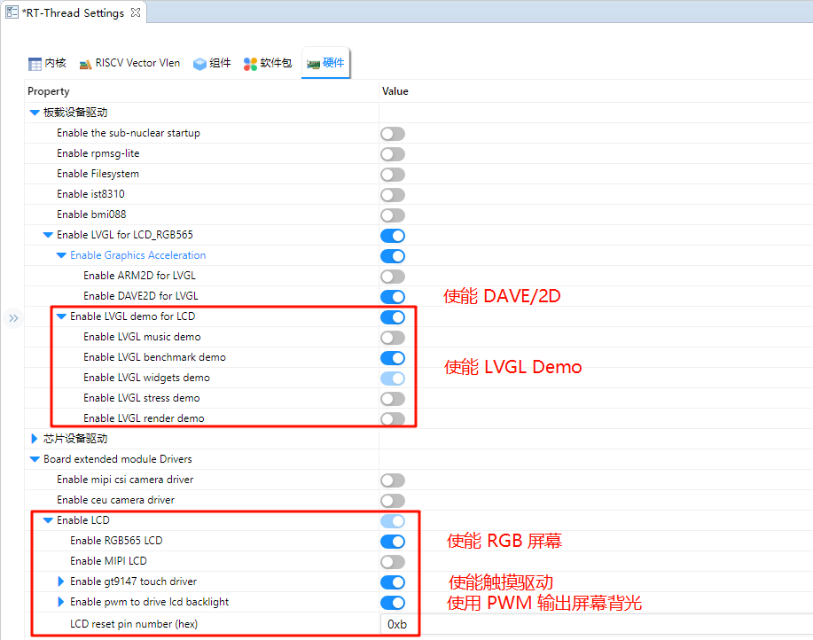

## Software Description

The LVGL-related code is located in `./board/lvgl`.

* lv_port_disp.c

```c
#include <lvgl.h>
#include <rtthread.h>
#include "ra8/lcd_config.h"
#include "hal_data.h"

static rt_sem_t _SemaphoreVsync = RT_NULL;
static uint8_t lvgl_init_flag = 0;

void DisplayVsyncCallback(display_callback_args_t *p_args)
{
    rt_interrupt_enter();
    if (DISPLAY_EVENT_LINE_DETECTION == p_args->event)
    {
        if (lvgl_init_flag != 0)
            rt_sem_release(_SemaphoreVsync);
    }
    rt_interrupt_leave();
}

static void vsync_wait_cb(lv_display_t *display)
{
    if (!lv_display_flush_is_last(display)) return;

    // If Vsync semaphore has already been set, clear it then wait to avoid tearing
    rt_sem_take(_SemaphoreVsync, RT_WAITING_FOREVER);
}

static void disp_flush(lv_display_t *display, const lv_area_t *area, uint8_t *px_map)
{
    if (!lv_display_flush_is_last(display)) return;

#if (BSP_CFG_DCACHE_ENABLED)
    int32_t size;
    /* Invalidate cache - so the HW can access any data written by the CPU */
    size = sizeof(fb_background[0]);

    SCB_CleanInvalidateDCache_by_Addr(px_map, size);
#endif

    R_GLCDC_BufferChange(&g_display0_ctrl,
                         (uint8_t *) px_map,
                         (display_frame_layer_t) 0);
}

void lv_port_disp_init(void)
{
    static rt_device_t device;
    /* LCD Device Init */
    device = rt_device_find("lcd");
    RT_ASSERT(device != RT_NULL);

    _SemaphoreVsync = rt_sem_create("lvgl_sem", 1, RT_IPC_FLAG_PRIO);

    if (RT_NULL == _SemaphoreVsync)
    {
        rt_kprintf("lvgl semaphore create failed\r\n");
        RT_ASSERT(0);
    }

    /*------------------------------------
     * Create a display and set a flush_cb
     * -----------------------------------*/
    lv_display_t *disp = lv_display_create(LV_HOR_RES_MAX, LV_VER_RES_MAX);
    lv_display_set_flush_cb(disp, disp_flush);
    lv_display_set_flush_wait_cb(disp, vsync_wait_cb);
    lv_display_set_buffers(disp, &fb_background[0][0], &fb_background[1][0], sizeof(fb_background[0]), LV_DISPLAY_RENDER_MODE_DIRECT);

    lvgl_init_flag = 1;
}
```

* lv_port_indev.c

```c
#include <lvgl.h>
#include <rtdevice.h>

#ifdef RT_USING_TOUCH

#include "gt9147.h"
#define GT9147_IRQ_PIN   BSP_IO_PORT_00_PIN_07
#define GT9147_RST_PIN   BSP_IO_PORT_04_PIN_12

#define DBG_TAG "lv_port_indev"
#define DBG_LVL DBG_LOG
#include <rtdbg.h>

#include "hal_data.h"

static rt_device_t touch_dev;
struct rt_touch_data *read_data;
static lv_indev_t *touch_indev;

#if LVGL_VERSION_MAJOR < 9
static void touchpad_read(lv_indev_drv_t *indev, lv_indev_data_t *data)
#else
static void touchpad_read(lv_indev_t *indev, lv_indev_data_t *data)
#endif
{
    if (RT_NULL != rt_device_read(touch_dev, 0, read_data, 1))
    {
        if (read_data->event == RT_TOUCH_EVENT_NONE)
            return;

        data->point.x = LV_HOR_RES_MAX - read_data->x_coordinate;
        data->point.y = LV_VER_RES_MAX - read_data->y_coordinate;

        if (read_data->event == RT_TOUCH_EVENT_DOWN)
            data->state = LV_INDEV_STATE_PR;
        if (read_data->event == RT_TOUCH_EVENT_MOVE)
            data->state = LV_INDEV_STATE_PR;
        if (read_data->event == RT_TOUCH_EVENT_UP)
            data->state = LV_INDEV_STATE_REL;
    }
}

static rt_err_t gt9147_probe(rt_uint16_t x, rt_uint16_t y)
{
    void *id;

    touch_dev = rt_device_find("gt9147");
    if (touch_dev == RT_NULL)
    {
        rt_kprintf("can't find device gt9147\n");
        return -1;
    }

    if (rt_device_open(touch_dev, RT_DEVICE_FLAG_INT_RX) != RT_EOK)
    {
        rt_kprintf("open device failed!");
        return -1;
    }

    id = rt_malloc(sizeof(struct rt_touch_info));
    rt_device_control(touch_dev, RT_TOUCH_CTRL_GET_ID, id);
    rt_uint8_t *read_id = (rt_uint8_t *)id;
    rt_kprintf("id = GT%d%d%d \n", read_id[0] - '0', read_id[1] - '0', read_id[2] - '0');

    rt_device_control(touch_dev, RT_TOUCH_CTRL_SET_X_RANGE, &x);  /* if possible you can set your x y coordinate*/
    rt_device_control(touch_dev, RT_TOUCH_CTRL_SET_Y_RANGE, &y);
    rt_device_control(touch_dev, RT_TOUCH_CTRL_GET_INFO, id);
    rt_kprintf("range_x = %d \n", (*(struct rt_touch_info *)id).range_x);
    rt_kprintf("range_y = %d \n", (*(struct rt_touch_info *)id).range_y);
    rt_kprintf("point_num = %d \n", (*(struct rt_touch_info *)id).point_num);
    rt_free(id);

    read_data = (struct rt_touch_data *)rt_calloc(1, sizeof(struct rt_touch_data));
    if (!read_data)
    {
        return -RT_ENOMEM;
    }

    return RT_EOK;
}

rt_err_t rt_hw_gt9147_register(void)
{
    struct rt_touch_config config;
    rt_uint8_t rst;
    rst = GT9147_RST_PIN;
    config.dev_name = "i2c0";
    config.irq_pin.pin = GT9147_IRQ_PIN;
    config.irq_pin.mode = PIN_MODE_INPUT_PULLDOWN;
    config.user_data = &rst;

    if (rt_hw_gt9147_init("gt9147", &config) != RT_EOK)
    {
        rt_kprintf("touch device gt9147 init failed.\n");
        return -RT_ERROR;
    }

    if (gt9147_probe(LV_HOR_RES_MAX, LV_VER_RES_MAX) != RT_EOK)
    {
        rt_kprintf("probe gt9147 failed.\n");
        return -RT_ERROR;
    }
    return RT_EOK;
}
#endif

void lv_port_indev_init(void)
{
#ifdef RT_USING_TOUCH

#if LVGL_VERSION_MAJOR < 9
    static lv_indev_drv_t indev_drv;         /* Descriptor of a input device driver */
    lv_indev_drv_init(&indev_drv);           /* Basic initialization */
    indev_drv.type = LV_INDEV_TYPE_POINTER;  /* Touch pad is a pointer-like device */
    indev_drv.read_cb = touchpad_read;       /* Set your driver function */

    /* Register the driver in LVGL and save the created input device object */
    touch_indev = lv_indev_drv_register(&indev_drv);
#else
    /*Register a touchpad input device*/
    touch_indev = lv_indev_create();
    lv_indev_set_type(touch_indev, LV_INDEV_TYPE_POINTER);
    lv_indev_set_read_cb(touch_indev, touchpad_read);
#endif
    /* Register touch device */
    rt_err_t res = rt_hw_gt9147_register();
    RT_ASSERT(res == RT_EOK);

#endif
}
```

## Compilation & Download

* **RT-Thread Studio**: In RT-Thread Studio’s package manager, download the Titan Board resource package, create a new project, and compile it.

After compilation, connect the development board’s USB-DBG interface to the PC and download the firmware to the development board.

## Run Effect

After resetting the development board, you can see the LVGL demo running on the LCD screen.

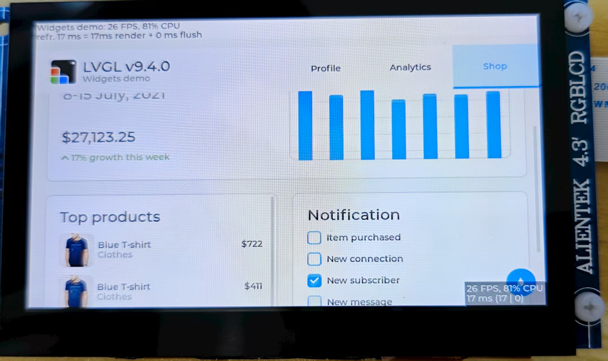

