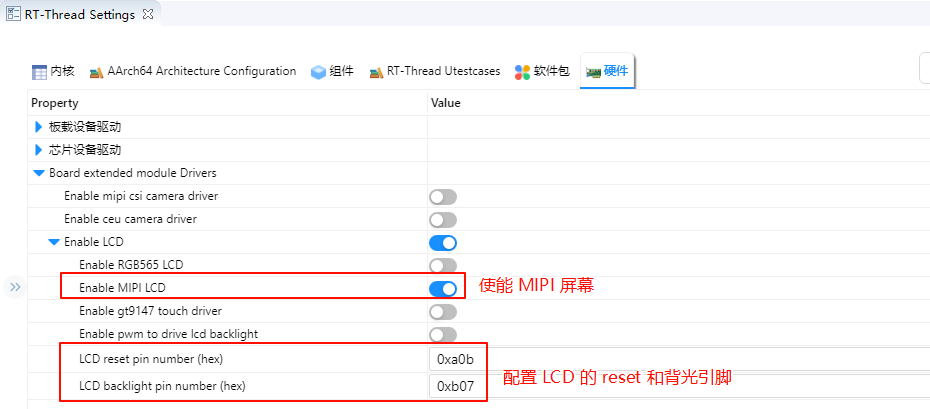

# MIPI LCD Usage Instructions

**English** | [**Chinese**](./README_zh.md)

## Introduction

This example demonstrates how to use the **GLCDC module of the RA8 series MCU** together with **RT-Thread's LCD driver framework** on the **Titan Board** to drive an MIPI LCD screen, enabling image display and interface updates. This document provides a detailed overview of **RA8 GLCDC peripheral features** and the **RT-Thread LCD driver framework**, along with example configurations and usage methods.

The MIPI screen model used for this routine is TL043WVV02CT.

## RA8 Series GLCDC Module

### 1. Overview

The **GLCDC (Graphics LCD Controller)** is a high-performance graphics controller integrated in RA8 series MCUs, specifically designed to drive TFT/RGB LCD screens. It supports various resolutions, color formats, and graphics processing functions. Combined with RT-Thread's **LCD driver framework**, it provides a unified interface for screen initialization, refresh, graphics rendering, and DMA-accelerated operations.

The RA8 **GLCDC** enables image output from either internal MCU memory or external frame buffers to RGB/LCD displays. Key features include:

- **Frame buffer control**: Supports multiple frame buffers for page switching or double-buffered display
- **Color format support**: RGB565, RGB888, ARGB8888, etc.
- **Graphics processing**: Background layers, text/graphics composition, alpha blending, palette mapping
- **Synchronization signal generation**: HSYNC, VSYNC, DE (Data Enable)
- **DMA support**: High-speed data transfer, reducing CPU load
- **Interrupt functionality**: Frame-end and line-end interrupts

### 2. Module Architecture

The RA8 GLCDC module mainly consists of the following submodules:

1. **Layer Composition Unit**
   - Supports multiple layer stacking
   - Provides alpha blending, transparency control, and color keying
   - Allows rotation and flipping of layers
2. **Frame Buffer Interface**
   - Supports access to MCU internal SRAM or external memory
   - Provides single or double buffering to ensure continuous display
   - Works with DMA to automatically read image data
3. **DMA Controller**
   - Automatically transfers pixel data to the RGB output port
   - Configurable burst length to improve bandwidth utilization
   - Supports circular transfer, suitable for video or animation scenarios
4. **Timing Generator**
   - Automatically generates HSYNC, VSYNC, and DE signals
   - Supports TTL interface RGB timing
   - Polarity, sync width, and front/back porch timings are configurable
5. **Interrupt and Event Controller**
   - Provides frame-end and line-end interrupts
   - Can be used for page switching, dynamic drawing, or scrolling display
   - Supports interrupts triggered by DMA transfer completion

### 3. GLCDC Working Principle

1. **Frame buffer read**
   - GLCDC uses DMA to fetch image data from memory, supporting single or double buffering for continuous display.
2. **Layer composition**
   - Supports multiple layers such as background + foreground + icons/text
   - Provides alpha blending and palette mapping
3. **Pixel timing output**
   - Generates HSYNC/VSYNC/DE signals according to LCD interface requirements
   - Supports RGB parallel interface, TTL interface, or LVDS (depending on board implementation)
4. **Interrupts and events**
   - **Frame-end interrupt (VBlank)**: Can be used to update the next frame
   - **Line-end interrupt**: Useful for scrolling displays or dynamic rendering

### 4. GLCDC Supported Features

| Feature Category | Description                                              |
| ---------------- | -------------------------------------------------------- |
| Resolution       | Up to 1280x800                                           |
| Color formats    | RGB565, RGB888, ARGB8888, etc.                           |
| Multi-layer      | Background + foreground + icon layers, supports blending |
| Frame buffer     | Single/double buffer mode, DMA improves performance      |
| Palette          | 8/16-bit palette mapping for color conversion            |
| Sync signals     | HSYNC, VSYNC, DE, configurable polarity and timing       |
| DMA support      | Automatic memory transfer, CPU-free                      |
| Interrupts       | Frame-end, line-end interrupts for synchronized refresh  |
| Rotation/Flip    | Supports 90°/180°/270° rotation and X/Y flipping         |

## Hardware Description

The following figure shows the MIPI DSI/CSI interface on the Titan Board. To connect the MIPI DSI screen, another adapter board is needed.


In this example, a Dupont wire is required to connect the **BL** pin on the display adapter board to the **PB07** pin (the GPIO pin used to provide backlight can be changed as needed).


## FSP Configuration

### HyperRAM Configuration

* Create a `r_ospi_b` stack：


* Configuration `r_ospi_b` stack：


* Configuration HyperRAM pins：


* The drive capability of all pins related to HyperRAM should be configured as H, and OM_1_SIO0 to OM_1_SIO7 need to be configured as Input pull-up.


### LCD Configuration

* Create a  `r_glcdc` stack:


* Configure interrupt callback and graph layer 1:


* Configure Output、CLUT、TCON and Dithering:


### MIPI DSI Configuration

* Create a `r_mipi_dsi` stack.


* Configure MIPI DSI_TE pins.


### D/AVE 2D Configuration

* Create a `r_drw` stack:


## RT-Thread Settings Configuration

* Enable MIPI LCD in RT-Thread Settings.



## Example Code Description

```c
int lcd_test(void)
{
    struct drv_lcd_device *lcd;
    struct rt_device_rect_info rect_info;
    rect_info.x = 0;
    rect_info.y = 0;
    rect_info.width = LCD_WIDTH;
    rect_info.height = LCD_HEIGHT;

    lcd = (struct drv_lcd_device *)rt_device_find("lcd");

    for (int i = 0; i < 2; i++)
    {
        /* red */
        for (int i = 0; i < LCD_BUF_SIZE / 2; i++)
        {
            lcd->lcd_info.framebuffer[2 * i] = 0x00;
            lcd->lcd_info.framebuffer[2 * i + 1] = 0xF8;
        }
        LOG_D("red buffer...");
        rt_device_control(&lcd->parent, RTGRAPHIC_CTRL_RECT_UPDATE, &rect_info);
        rt_thread_mdelay(1000);
        /* green */
        for (int i = 0; i < LCD_BUF_SIZE / 2; i++)
        {
            lcd->lcd_info.framebuffer[2 * i] = 0xE0;
            lcd->lcd_info.framebuffer[2 * i + 1] = 0x07;
        }
        LOG_D("green buffer...");
        rt_device_control(&lcd->parent, RTGRAPHIC_CTRL_RECT_UPDATE, &rect_info);
        rt_thread_mdelay(1000);
        /* blue */
        for (int i = 0; i < LCD_BUF_SIZE / 2; i++)
        {
            lcd->lcd_info.framebuffer[2 * i] = 0x1F;
            lcd->lcd_info.framebuffer[2 * i + 1] = 0x00;
        }
        LOG_D("blue buffer...");
        rt_device_control(&lcd->parent, RTGRAPHIC_CTRL_RECT_UPDATE, &rect_info);
        rt_thread_mdelay(1000);
    }
    return RT_EOK;
}
MSH_CMD_EXPORT(lcd_test, lcd test cmd);
```

## Compilation & Download

* **RT-Thread Studio**: In RT-Thread Studio’s package manager, download the Titan Board resource package, create a new project, and compile it.


After compilation, connect the development board’s USB-DBG interface to the PC and download the firmware to the development board.

## Run Effect

After reset the development board, type `lcd_test` command in the terminal to run the brush program.


