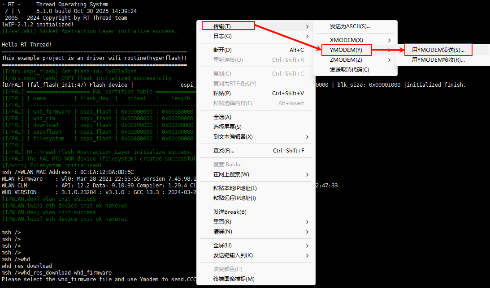
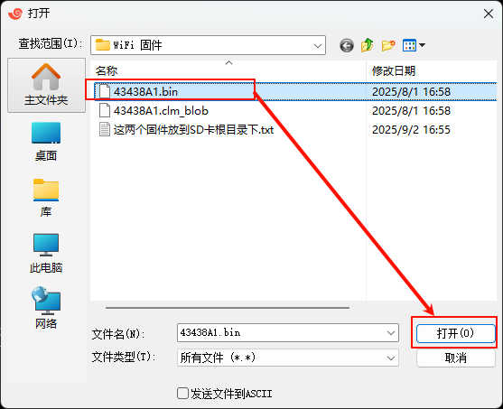
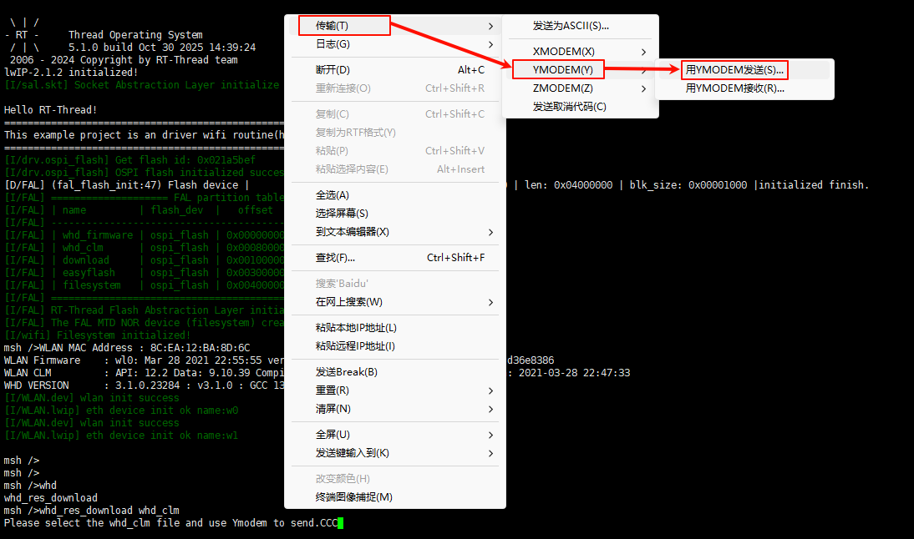
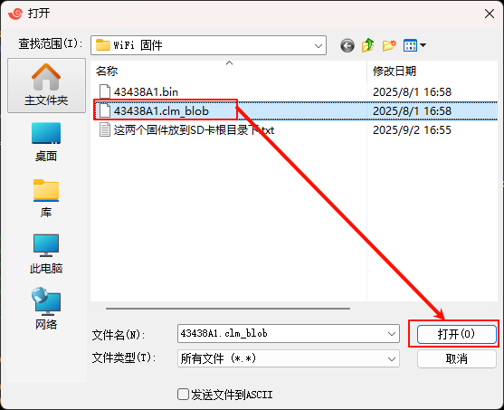

# Wi-Fi Usage Instructions

**English**|[**Chinese**](README_zh.md)

## Introduction

This example demonstrates how to use the **RA8 series MCU SDHI module (r_sdhi)** on the **Titan Board** to drive the **CYWL6208-GS WiFi module**, enabling wireless network connectivity via the SDIO interface.
 In this example, the MCU communicates with the CYWL6208-GS module (chip CYW43438) through the **SDIO bus**, and integrates with the RT-Thread network stack (lwIP) to achieve TCP/IP network functionality.

## WiFi Introduction

### 1. Overview

**WiFi (Wireless Fidelity)** is a wireless local area network (WLAN) communication technology based on the **IEEE 802.11 standard**.
 It transmits data between terminal devices (such as MCUs, smartphones, PCs, or IoT devices) and access points (APs) via radio waves, providing **short-range high-speed wireless communication**.

WiFi is currently one of the most widely used wireless technologies, commonly applied in home networks, office networks, industrial control, smart homes, and IoT devices.

### 2. Working Principle

1. **Communication Method**
   - WiFi uses the **ISM bands** (2.4 GHz, 5 GHz, 6 GHz) and modulation schemes such as **OFDM, DSSS, and QAM** for data transmission.
   - WiFi networks consist of **Access Points (APs)** and **Stations (STAs)**.
2. **Data Transmission Flow**
   - The STA scans for available WiFi networks.
   - STA sends authentication and association requests.
   - The AP completes handshake and key negotiation.
   - Once a secure communication channel is established between STA and AP, data transmission occurs.

### 3. WiFi Standards

Different WiFi versions correspond to the IEEE 802.11 standards:

| Standard              | Frequency Band | Max Rate | Features                                          |
| --------------------- | -------------- | -------- | ------------------------------------------------- |
| **802.11b**           | 2.4 GHz        | 11 Mbps  | Early version, poor interference resistance       |
| **802.11g**           | 2.4 GHz        | 54 Mbps  | Backward compatible with 802.11b                  |
| **802.11n (WiFi 4)**  | 2.4/5 GHz      | 600 Mbps | MIMO technology                                   |
| **802.11ac (WiFi 5)** | 5 GHz          | 3.5 Gbps | MU-MIMO, 80/160 MHz channels                      |
| **802.11ax (WiFi 6)** | 2.4/5/6 GHz    | 9.6 Gbps | OFDMA, lower latency, higher concurrency          |
| **802.11be (WiFi 7)** | 2.4/5/6 GHz    | >30 Gbps | Multi-link operation (MLO), ultra-high throughput |

### 4. WiFi Modes

- **STA mode (Station)**: Device connects to an AP.
- **AP mode (Access Point)**: Device provides network access as a hotspot.
- **P2P mode (Peer-to-Peer/Ad-Hoc)**: Direct device-to-device communication.
- **Hybrid mode**: Both STA and AP functions coexist.

### 5. WiFi Security

- **WEP** (deprecated, insecure)
- **WPA/WPA2**: TKIP/AES-based encryption, mainstream security
- **WPA3**: Enhanced security, supports SAE handshake to prevent brute-force attacks

### 6. WiFi Characteristics

#### Advantages

- High-speed transmission (Gbps level)
- Widely supported (phones, PCs, MCUs, etc.)
- Low cost, mature ecosystem
- Can connect multiple devices simultaneously

#### Disadvantages

- High power consumption, unsuitable for ultra-low-power applications
- Limited transmission range (typically 10–100 m)
- 2.4 GHz band prone to interference (Bluetooth, microwave ovens, etc.)

## RA8 Series SDHI Module Introduction

The **RA8 series MCU SDHI (SD Host Interface) module** is a host controller compliant with **SD/SDIO/eMMC standards**, capable of communicating with storage devices (SD card, eMMC) or SDIO peripherals (e.g., WiFi, Bluetooth modules) via **1-bit or 4-bit data lines**.

In **storage applications**, it functions as an SD/eMMC controller for high-speed read/write operations. In **peripheral expansion applications**, it acts as an SDIO host to establish data channels with WiFi, Bluetooth, GNSS, and other modules.

In this example, SDHI is used to drive the **CYWL6208-GS WiFi module (SDIO interface)** to enable wireless networking for the MCU.

### 1. Key Features

- **SD Standard Support**
  - SD v1.x / v2.x / SDHC / SDXC
  - Supports SPI mode and SD/MMC mode
- **High-Speed Data Transfer**
  - Up to 50 MHz SDCLK (depending on MCU clock configuration)
  - Supports 1-bit / 4-bit bus
- **Automatic Command and Data Transfer**
  - DMA support reduces CPU usage
  - Automatic command sequence generation (CMD0~CMD63)
- **Error Detection**
  - CRC7 for commands, CRC16 for data
  - Timeout detection and response error recognition
- **Interrupt Support**
  - Card insertion/removal detection
  - Command completion
  - Data transfer completion
  - Error interrupt

### 2. SDHI Module Architecture

The RA8 SDHI module consists of the following sub-modules:

1. **Command Control Unit**
   - Sends commands (CMD0~CMD63)
   - Handles responses (R1, R2, R3, R7, etc.)
   - Supports command timeout detection and CRC check
2. **Data Transfer Unit**
   - Data send/receive via internal FIFO or DMA
   - Supports block read/write, maximum 512-byte block
   - Single/multi-block transfer modes
3. **Clock and Bus Control**
   - SDCLK generation and division
   - 1-bit / 4-bit bus width switching
   - Configurable high/low-level hold time
4. **Card Detection and Power Control**
   - Detect card insertion/removal
   - Control card power if supported
5. **Interrupt and Event Control Unit**
   - Command completion interrupt
   - Data transfer completion interrupt
   - Error interrupt
   - Card insertion/removal interrupt

### 3. Workflow (Example: SDIO WiFi)

1. **Hardware Initialization**
   - Configure SDHI pins: CMD, CLK, DAT0~3
   - Enable clock, reset SDHI controller
2. **Bus Initialization**
   - Set clock frequency (initial low → high speed)
   - Send initialization commands (CMD0, CMD5, CMD3, etc.)
   - Enumerate device and assign RCA
3. **Function Configuration**
   - Identify SDIO WiFi device
   - Configure block size, bus width, transfer rate
   - Enable interrupts
4. **Normal Operation**
   - WiFi driver accesses control registers and data transfer interface
   - MCU exchanges large packets with WiFi chip via **DMA + interrupts**
   - Upper layer protocol stack (lwIP) completes TCP/IP communication

## Hardware Description

## FSP Configuration

* The first step is to configure Flash. See the README.md in the `Titan_component_flash_fs` project for the Flash configuration.
* Next, configure SDHI1 and create a new `r_sdhi` stack:

* Configure `r_sdhi` stack:

* Configure SDHI1 pins：

## RT-Thread Settings Configuration

* Enable ospi Flash.

* The Bus Width of SDHI1 is set to 4.

* Configure the WHD package.

## Compilation & Download

* **RT-Thread Studio**: In RT-Thread Studio’s package manager, download the Titan Board resource package, create a new project, and compile it.

After compilation, connect the development board’s USB-DBG interface to the PC and download the firmware to the development board.

## Run Effect

Press the reset button to restart the development board, if the terminal output firmware read error information, then you need to use **ymodem** to download WiFi firmware to Flash. Use the `whd_res_download whd_firmware` command to download `43438A1.bin` into the `whd_firmware` partition of Flash; Use the `whd_res_download whd_clm` command to download `43438A1.clm_blob` into the `whd_clm` partition of the Flash.

The WiFi firmware can be found in the `/firmware` folder of the project root.

**Download WiFi firmware :**

Use a serial tool that supports **YMODEM**, such as **Xshell**.

After entering the command `whd_res_download whd_firmware`, right-click in the window, then select **Transfer → YMODEM → Send with YMODEM**.

Select the `43438A1.bin` file, then click **Open** to start flashing `43438A1.bin`.

After entering the command `whd_res_download whd_clm`, right-click in the window, then select **Transfer → YMODEM → Send with YMODEM**.

Select the `43438A1.clm_blob` file, then click **Open** to start flashing `43438A1.clm_blob`.

**Test WiFi:**

After downloading the WiFi firmware, reset the Titan Board, and you can see that the WiFi firmware is loaded normally and the WiFi module is initialized successfully. Then type `wifi join ssid password` to connect to WiFi and `ping baidu.com` to ping test.

