# NPU 加速人脸检测使用说明

**中文** | [**English**](./README.md)

## 简介

本示例展示了如何在 **Titan Board** 上，利用 **Arm® Ethos™-U55 NPU** 加速运行 **YOLO-Fastest 人脸检测模型**，并结合 **CEU（Camera Engine Unit）摄像头接口** 和 **RGB LCD 显示屏** 实现实时人脸检测与显示。

主要功能包括：

- 通过 CEU 采集实时视频流（OV5640 摄像头）
- 使用 NPU 对视频帧进行 YOLO-Fastest 模型推理
- 在 LCD 屏幕上显示检测结果（带人脸框）
- 支持硬件加速的 YUV → RGB 转换与图形绘制

## 系统整体架构

本示例的系统数据流如下图所示：

```css
[OV5640 摄像头]
        │
        ▼
[CEU 摄像头采集模块]
        │ (YUV422)
        ▼
[DMA 传输到 Frame Buffer (HyperRAM)]
        │
        ├──► [NPU (Ethos-U55) 运行 YOLO-Fastest 推理]
        │         │
        │         ▼
        │     [检测结果：坐标 + 置信度]
        │
        └──► [GLCDC 显示控制器]
                  │
                  ▼
          [RGB LCD 实时显示]
```

## Arm® Ethos™-U55 NPU 特性

Titan Board 使用的 RA8P1 MCU 集成 **Arm® Ethos™-U55 神经处理单元（NPU）**，可与 Cortex-M85 CPU 协同工作，大幅提升神经网络推理性能。

### 1. 硬件特性

1. **算力与加速**
   - 支持 INT8 量化模型
   - 性能可达数百 GOPS（依型号配置）
   - 支持卷积、池化、ReLU、Softmax 等常见算子
2. **与 CPU 协同**
   - 通过 CMSIS-NN & Ethos-U 驱动与 Cortex-M85 协作
   - 支持 NPU 与 CPU 异步执行
   - 模型前后处理由 CPU 完成
3. **存储与带宽**
   - 支持从片上 SRAM 或外部 HyperRAM 直接读取特征图
   - DMA 加速模型输入/输出数据搬运
   - 支持多层缓存机制减少延迟
4. **兼容性**
   - 与 TensorFlow Lite for Microcontrollers (TFLM) 完全兼容
   - 支持 Arm NN SDK 转换的模型格式 (.tflite)

## YOLO-Fastest 模型介绍

**YOLO-Fastest** 是轻量级目标检测网络，适合嵌入式设备实时运行。

| 项目                  | 参数                         |
| --------------------- | ---------------------------- |
| 模型类型              | YOLO-Fastest（人脸检测版本） |
| 模型框架              | TensorFlow Lite (INT8)       |
| 输入尺寸              | 192 x 192                    |
| 输出                  | 人脸检测框坐标 + 置信度      |
| 推理时间（Ethos-U55） | 约 25 ms / 帧                |
| 适用场景              | 人脸检测 / 实时视觉识别      |

## FSP 配置

### HyperRAM 配置

* 新建 r_ospi_b stack：


* 配置 r_ospi_b stack：


* HyperRAM 引脚配置：


* HyperRAM 所有相关引脚的驱动能力配置为 H，OM_1_SIO0~OM_1_SIO7 需要配置为输入上拉。


### CEU 配置

* 新建 `r_ceu` stack：

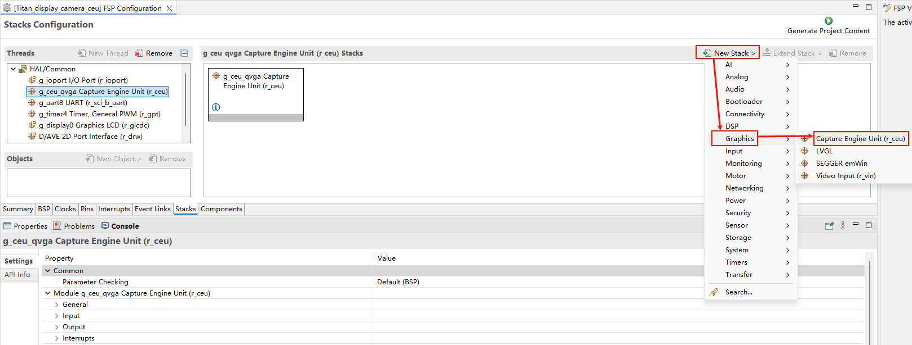

* 配置 CEU：

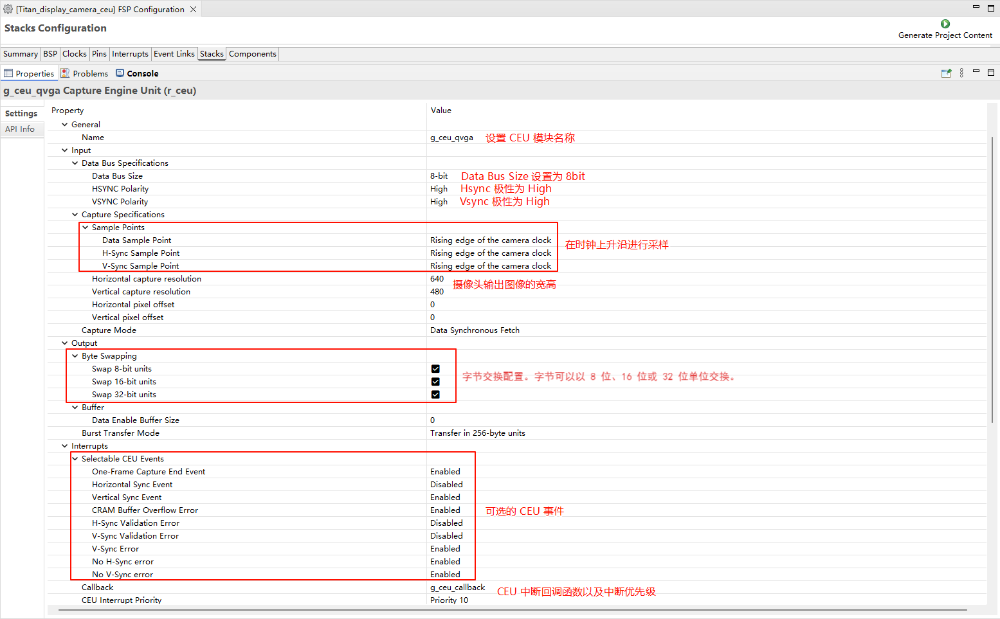

* 配置 CEU 引脚：

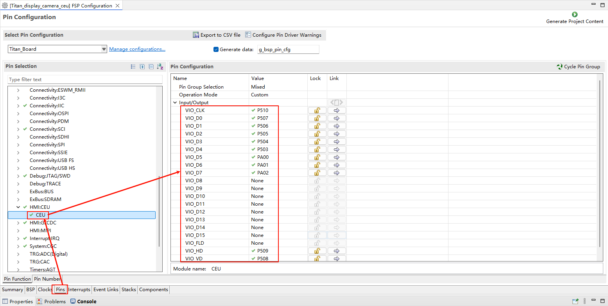

### CEU 时钟配置

* 新建 `r_gpt` stack：

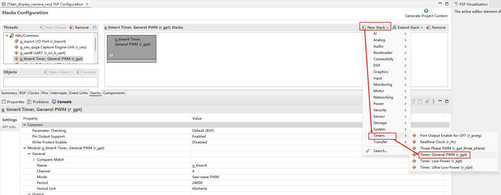

* 配置摄像头时钟 PWM 输出：

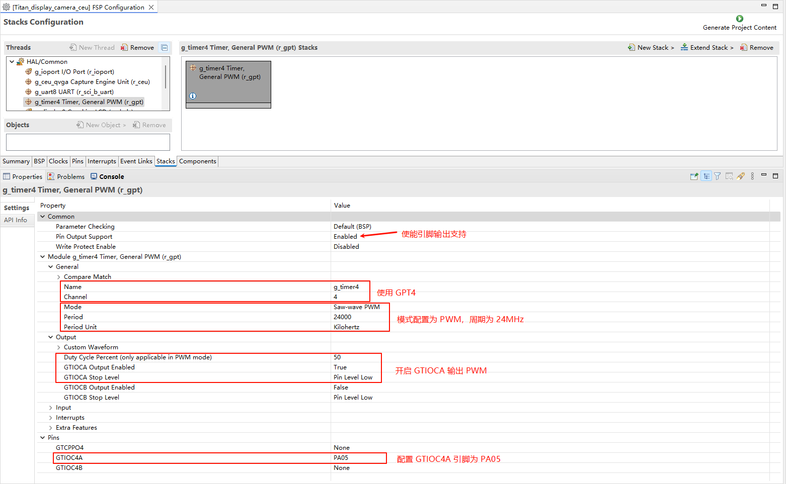

### D/AVE 2D 配置

* 新建 `r_drw` stack：


### RGB LCD 配置

* 新建 `r_glcdc` stack：

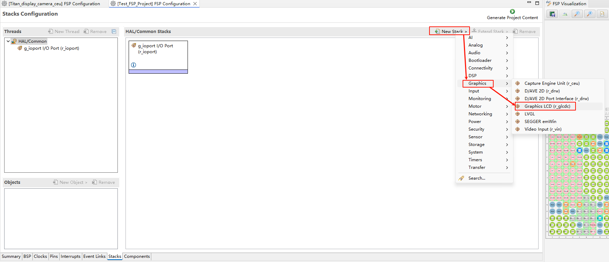

* 配置中断回调和图形层1：

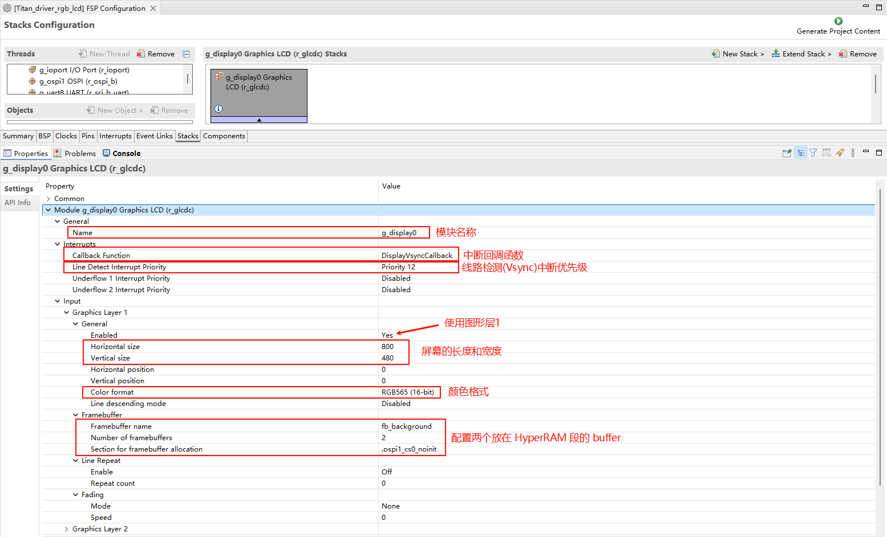

* 配置输出参数、CLUT、TCON和抖动。

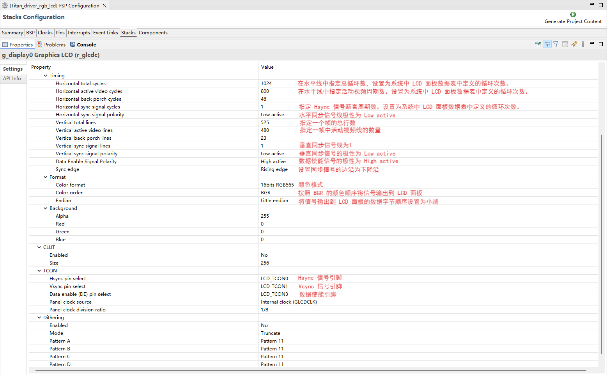

* 配置 GLCDC 的引脚：


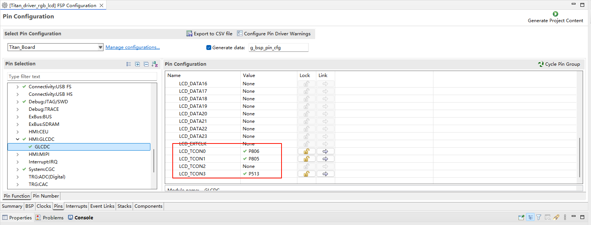

### LCD 背光配置

* 新建 `r_gpt` stack：


* 配置背光 PWM 输出：

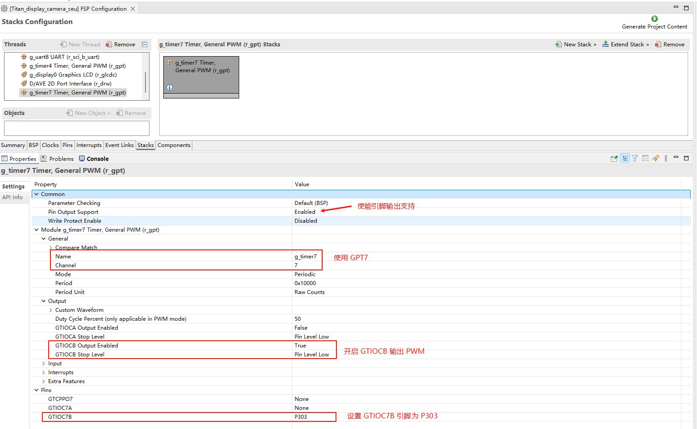

### NPU 配置

创建 Google TFLM Core Lib stack:


## RT-Thread Settings 配置

* 使能 CUE 摄像头，使用 i2c1 和 ov5640 摄像头；使能 RGB565 LCD，使用 pwm7 输出背光。

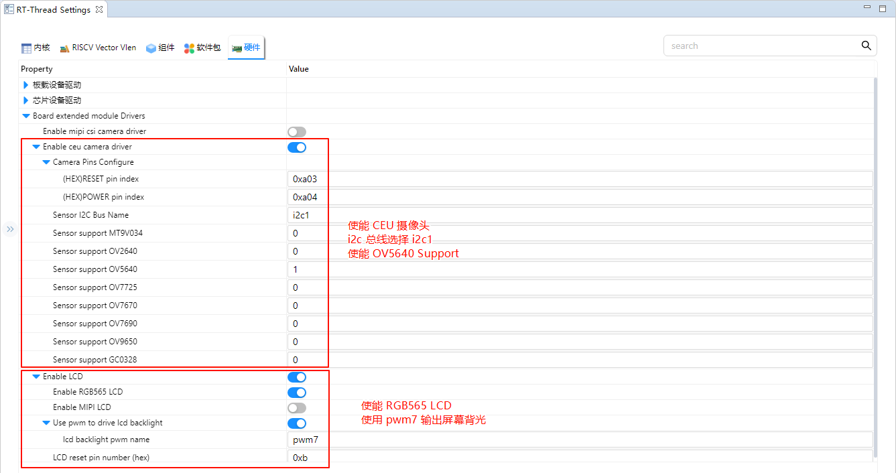

## 编译&下载

- RT-Thread Studio：在RT-Thread Studio 的包管理器中下载 Titan Board 资源包，然后创建新工程，执行编译。

编译完成后，将开发板的 USB-DBG 接口与PC 机连接，然后将固件下载至开发板。

## 运行效果

复位 Titan Board 后准备一张人脸图片放到摄像头面前，此时观察 LCD 屏幕能看到人脸被一个绿色的矩形框了出来。

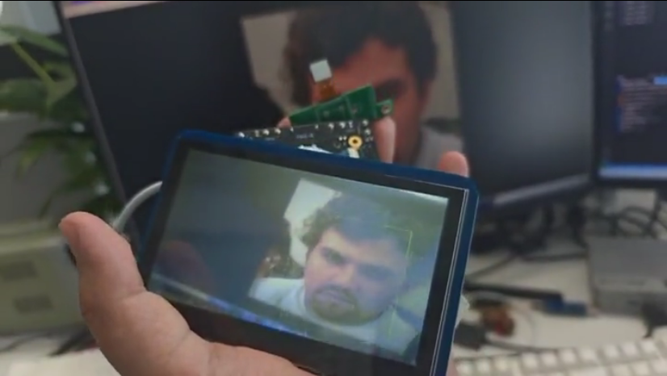


